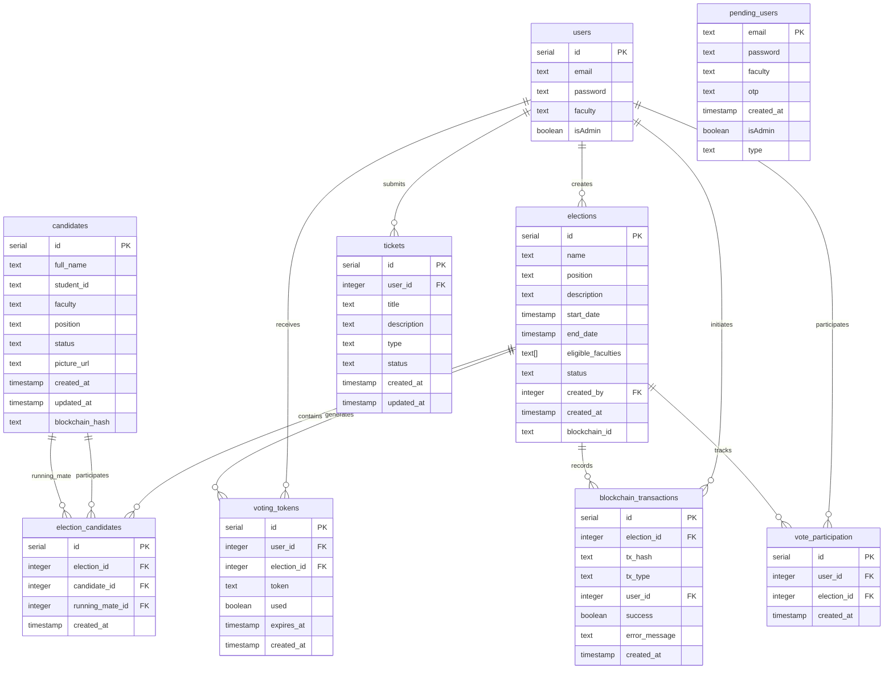

# ADA University Voting System - Entity Relationship Diagram

This ERD shows the following relationships:

1. Users can create multiple elections (admin users)
2. Users receive voting tokens for elections
3. Users can submit multiple tickets
4. Users can initiate multiple blockchain transactions
5. Users can participate in multiple elections
6. Elections contain multiple candidates through election_candidates
7. Elections generate multiple voting tokens
8. Elections record multiple blockchain transactions
9. Elections track multiple vote participations
10. Candidates can participate in multiple elections
11. Candidates can be running mates in multiple elections

Key Features:
- Full audit trail through blockchain_transactions
- Secure voting token system
- Support for president/VP paired candidacies
- Comprehensive user feedback system through tickets
- Faculty-based access control
- Multi-stage election lifecycle management
